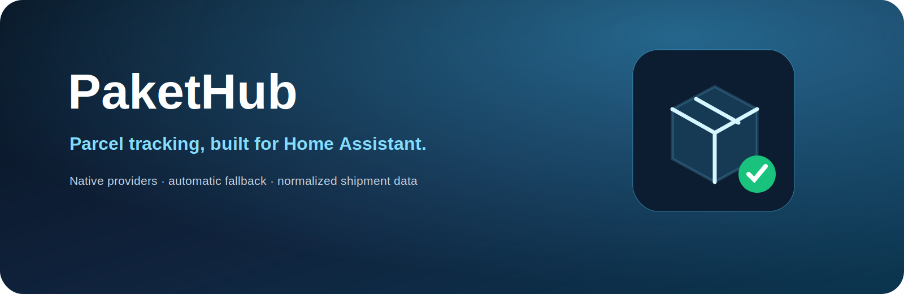

<div align="center">


[](https://github.com/eifeldj/pakethub/releases)
[](https://eifeldj.github.io/pakethub/)
[](https://hacs.xyz/)
[](https://www.home-assistant.io/)
[](LICENSE)
[](https://github.com/eifeldj/pakethub/issues)

**Alle Sendungen an einem Ort – mit nativen Providern, automatischem Fallback und eigener Home-Assistant-Dashboardkarte.**

[Website & documentation](https://eifeldj.github.io/pakethub/de/) · [Installation](#installation) · [Support](#support)

[English](README.md) · Deutsch
</div>

---

## Überblick

PaketHub ist eine benutzerdefinierte Home-Assistant-Integration zur Paketverfolgung über die offizielle **17TRACK API v2.4**. Wo verfügbar, nutzt PaketHub native Carrier-Provider, wechselt bei Bedarf automatisch zum Fallback und stellt normalisierte Sendungsdaten als Geräte, Entitäten und Dashboardkarte bereit.

**Current integration version / Aktuelle Integrationsversion:** `2.5.1`

## Funktionen

- Einrichtung über die Benutzeroberfläche und konfigurierbares Abfrageintervall
- Ein Home-Assistant-Gerät pro Sendung
- Zentrales PaketHub-Gerät mit Zählern, Synchronisierungsstatus, API-Verbindung und Aktualisierungstaste
- Status, Ort, letztes Ereignis, letzte Aktualisierung, ETA, Laufzeit und Carrier
- Vollständiger Trackingverlauf und barrierearmer Detaildialog
- Natives UPS-Tracking mit automatischem 17TRACK-Fallback
- Erweiterbare Provider-Architektur und Diagnose
- Native Lovelace-Karte mit automatischer Sendungserkennung
- Deutsche und englische Übersetzungen

## Architektur

```text
Tracking number / Trackingnummer
        ↓
Carrier detection / Carrier-Erkennung
        ↓
Native provider ── unavailable/error ──→ 17TRACK fallback
        ↓
Normalized shipment model
        ↓
Home Assistant devices, entities and PaketHub dashboard card
```

## Installation

### HACS

1. Öffne **HACS** und wähle **Benutzerdefinierte Repositories**.
2. Füge `https://github.com/eifeldj/pakethub` als **Integration** hinzu.
3. Installiere **PaketHub** und starte Home Assistant neu.
4. Öffne **Einstellungen → Geräte & Dienste → Integration hinzufügen**.
5. Wähle PaketHub und trage deinen Schlüssel für 17TRACK API v2.4 ein.

### Manual installation / Manuelle Installation

Copy `custom_components/pakethub` to `/config/custom_components/pakethub`, restart Home Assistant and add PaketHub through the integrations UI.

## Dashboardkarte

```yaml
type: custom:pakethub-card
title: My packages
show_delivered: false
max_packages: 8
sort_by: status
tap_action: details
```

See [`dashboard/README.md`](dashboard/README.md) for YAML-mode dashboards.

## Aktionen

```yaml
action: pakethub.add_package
data:
  tracking_number: EXAMPLE1234567890
  package_name: Example order
```

```yaml
action: pakethub.remove_package
data:
  tracking_number: EXAMPLE1234567890
```

```yaml
action: pakethub.refresh
```

## Dokumentation

**[https://eifeldj.github.io/pakethub/de/](https://eifeldj.github.io/pakethub/de/)**

## Mitwirken und Support

Read [`CONTRIBUTING.md`](CONTRIBUTING.md) and [`SUPPORT.md`](SUPPORT.md).

Veröffentliche niemals API-Schlüssel, vollständige Trackingnummern, Adressen oder private Sendungsdetails.

- [Bug report](https://github.com/eifeldj/pakethub/issues/new?template=bug_report.yml)
- [Feature request](https://github.com/eifeldj/pakethub/issues/new?template=feature_request.yml)
- [Native provider request](https://github.com/eifeldj/pakethub/issues/new?template=provider_request.yml)
- [Security policy](SECURITY.md)

## Project links

[Documentation](https://eifeldj.github.io/pakethub/de/) · [Releases](https://github.com/eifeldj/pakethub/releases) · [Roadmap](https://eifeldj.github.io/pakethub/de/roadmap/) · [Changelog](CHANGELOG.md) · [License](LICENSE)

<div align="center"><sub>Created and maintained by Volker Moeltgen · <a href="https://github.com/eifeldj">@eifeldj</a></sub></div>
