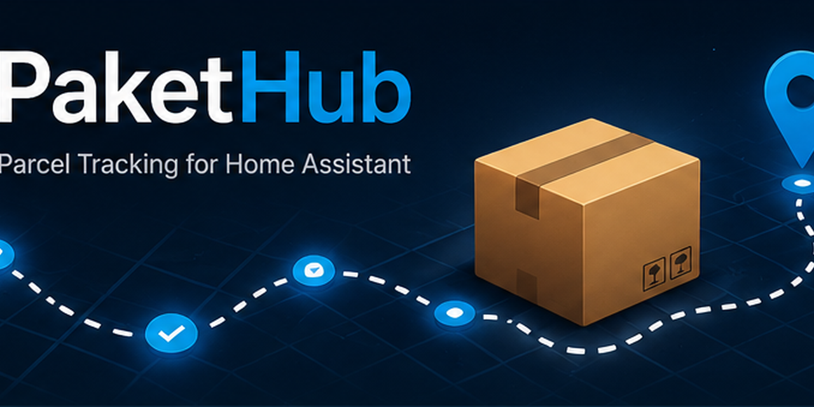

# PaketHub



PaketHub ist eine benutzerdefinierte Home-Assistant-Integration zur Paketverfolgung über die offizielle 17TRACK API v2.4.

[English documentation](README.md)

## Funktionen

- Einrichtung über die Home-Assistant-Oberfläche
- Eigene Geräte und Sensoren pro Sendung
- Native Lovelace-Karte mit automatischer Sendungserkennung
- Paketdetailansicht mit chronologischer Tracking-Timeline
- Paketdienst-Badges, Statusfarben, Fortschrittsbalken und hervorgehobene ETA
- Trackingnummer direkt auf der Karte oder in der Detailansicht kopieren
- Direkter Link zu 17TRACK und zu den Home-Assistant-Entitätsdetails
- Deutsche und englische Übersetzungen

## Installation über HACS

1. In HACS **Benutzerdefinierte Repositories** öffnen.
2. `https://github.com/eifeldj/pakethub` als **Integration** hinzufügen.
3. PaketHub installieren und Home Assistant neu starten.
4. Unter **Einstellungen → Geräte & Dienste → Integration hinzufügen** PaketHub auswählen.
5. Den API-Schlüssel der offiziellen 17TRACK API v2.4 eingeben.

## Dashboard-Karte

```yaml
type: custom:pakethub-card
title: Meine Pakete
show_delivered: false
max_packages: 8
sort_by: status
tap_action: details
```

`tap_action` unterstützt `details`, `url` und `more-info`.

## Datenschutz

In öffentlichen Issues niemals API-Schlüssel, vollständige Trackingnummern, Adressen oder private Sendungsdetails veröffentlichen.

## Lizenz

MIT License.
