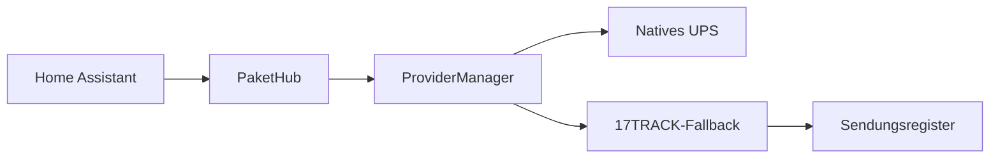

# PaketHub

**Paketverfolgung für Home Assistant**

PaketHub verbindet die offizielle 17TRACK-API mit einer erweiterbaren nativen Provider-Architektur und einer eigenen Home-Assistant-Dashboard-Karte.

[PaketHub installieren](installation.md){ .md-button .md-button--primary }
[Auf GitHub öffnen](https://github.com/eifeldj/pakethub){ .md-button }

## Highlights

-   :material-package-variant-closed:{ .lg .middle } **Sendungsübersicht**

    Ein Home-Assistant-Gerät pro Sendung mit Status, ETA, Standort, Fortschritt und Verlauf.

-   :material-truck-fast:{ .lg .middle } **Native Anbieter**

    Native UPS-Verfolgung mit automatischem Rückfall auf 17TRACK.

-   :material-view-dashboard:{ .lg .middle } **Dashboard-Karte**

    Responsive PaketHub-Karte mit Carrier-Branding und chronologischer Detailansicht.

-   :material-chart-timeline-variant:{ .lg .middle } **Diagnose**

    Provider-Nutzung, Fallbacks, API-Laufzeiten und Aktualisierungsstatistiken.

## Architektur

!!! note "Hinweis"
    17TRACK bleibt das Sendungsregister. Native Provider ergänzen die Verfolgung und greifen bei Bedarf automatisch auf 17TRACK zurück.
