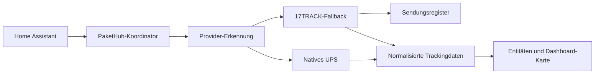

---
hide:
  - navigation
  - toc
description: PaketHub ist eine moderne Paketverfolgungs-Integration für Home Assistant.
---

# PaketHub

Paketverfolgung, die sich in Home Assistant zuhause fühlt.

PaketHub verbindet die offizielle 17TRACK-API, native Carrier-Provider, automatischen Fallback, Diagnose und eine eigens entwickelte Dashboard-Karte.

[Schnellstart](quickstart.md){ .md-button .md-button--primary }
[Installation](installation.md){ .md-button }
[Auf GitHub öffnen](https://github.com/eifeldj/pakethub){ .md-button }

<strong>2</strong>Tracking-Provider

<strong>2</strong>Sprachen

<strong>1</strong>zentrales Dashboard

## Für hilfreiche Paketverfolgung gebaut

-   :material-package-variant-closed:{ .lg .middle } **Alle Sendungen an einem Ort**

    Status, ETA, Standort, Fortschritt und Verlauf stehen direkt in Home Assistant bereit.

    [Funktionen entdecken](features.md)

-   :material-truck-fast:{ .lg .middle } **Intelligente Provider-Auswahl**

    PaketHub erkennt den Carrier, nutzt zuerst den nativen Provider und wechselt bei Bedarf automatisch zum Fallback.

    [Provider-Architektur](providers.md)

-   :material-view-dashboard-variant:{ .lg .middle } **Eigene Dashboard-Karte**

    Responsive Darstellung mit Paketübersicht, Carrier-Branding und chronologischen Details.

    [Dashboard-Karte konfigurieren](dashboard-card.md)

-   :material-chart-timeline-variant-shimmer:{ .lg .middle } **Transparente Diagnose**

    Provider-Nutzung, Fallbacks, API-Laufzeiten, Update-Dauer und Versionsabgleich.

    [Diagnose-Anleitung](diagnostics.md)

## So arbeitet PaketHub

## Unterstützte Provider

:material-radar: 17TRACK · Register & Fallback
:material-truck: UPS · natives Tracking

!!! tip "Auf Wachstum ausgelegt"
    Das Provider-Framework ist bewusst erweiterbar, damit weitere Carrier integriert werden können, ohne die Bedienung zu verändern.
