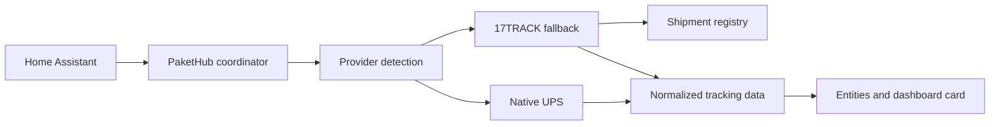

---
hide:
  - navigation
  - toc
description: PaketHub is a modern parcel-tracking integration for Home Assistant.
---

# PaketHub

Parcel tracking that feels native to Home Assistant.

PaketHub combines the official 17TRACK API, native carrier providers, automatic fallback, diagnostics and a purpose-built dashboard card.

[Get started](quickstart.md){ .md-button .md-button--primary }
[Installation](installation.md){ .md-button }
[View on GitHub](https://github.com/eifeldj/pakethub){ .md-button }

<strong>2</strong>tracking providers

<strong>2</strong>languages

<strong>1</strong>unified dashboard

## Built for useful tracking

-   :material-package-variant-closed:{ .lg .middle } **One place for every shipment**

    Status, ETA, location, progress and tracking history are available in Home Assistant.

    [Explore features](features.md)

-   :material-truck-fast:{ .lg .middle } **Native provider intelligence**

    PaketHub detects the carrier, tries the native provider first and falls back automatically.

    [Provider architecture](providers.md)

-   :material-view-dashboard-variant:{ .lg .middle } **A dedicated dashboard card**

    A responsive card with package summaries, carrier branding and chronological details.

    [Configure the card](dashboard-card.md)

-   :material-chart-timeline-variant-shimmer:{ .lg .middle } **Transparent diagnostics**

    Provider usage, fallbacks, API runtimes, update duration and version synchronization.

    [Open diagnostics guide](diagnostics.md)

## How PaketHub works

## Supported providers

:material-radar: 17TRACK · registry & fallback
:material-truck: UPS · native tracking

!!! tip "Designed to grow"
    The provider framework is intentionally extensible, so more carrier-specific integrations can be added without changing the user experience.
