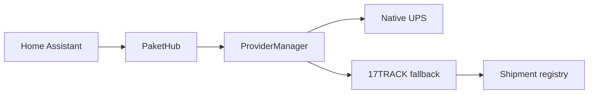

# PaketHub

**Parcel tracking for Home Assistant**

PaketHub combines the official 17TRACK API with an extensible native-provider architecture and a dedicated Home Assistant dashboard card.

[Install PaketHub](installation.md){ .md-button .md-button--primary }
[View on GitHub](https://github.com/eifeldj/pakethub){ .md-button }

## Highlights

-   :material-package-variant-closed:{ .lg .middle } **Shipment overview**

    One Home Assistant device per shipment with status, ETA, location, progress and tracking history.

-   :material-truck-fast:{ .lg .middle } **Native providers**

    Native UPS tracking with automatic fallback to 17TRACK.

-   :material-view-dashboard:{ .lg .middle } **Dashboard card**

    Responsive PaketHub card with carrier branding and a chronological detail view.

-   :material-chart-timeline-variant:{ .lg .middle } **Diagnostics**

    Provider usage, fallbacks, API runtimes and update statistics.

## Architecture

!!! note
    17TRACK remains the shipment registry. Native providers supplement tracking and automatically fall back to 17TRACK when required.
